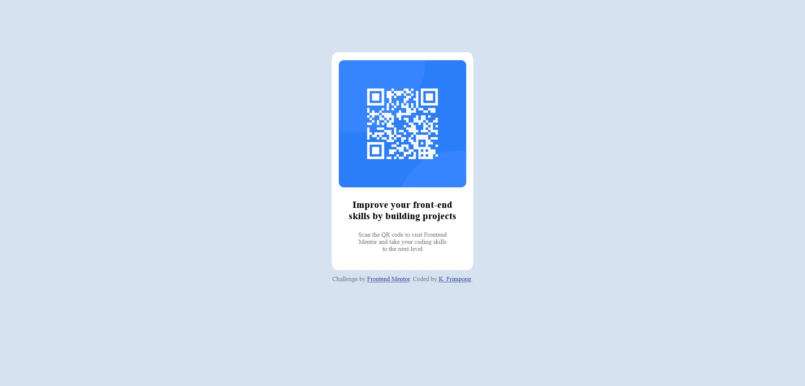

# Frontend Mentor - QR code component solution

This is a solution to the [QR code component challenge on Frontend Mentor](https://www.frontendmentor.io/challenges/qr-code-component-iux_sIO_H). Frontend Mentor challenges help you improve your coding skills by building realistic projects. 

## Table of contents

- [Overview](#overview)
  - [Screenshot](#screenshot)
  - [Links](#links)
- [My process](#my-process)
  - [Built with](#built-with)
  - [What I learned](#what-i-learned)
  - [Continued development](#continued-development)
  - [Useful resources](#useful-resources)
- [Author](#author)
- [Acknowledgments](#acknowledgments)

**Note: Delete this note and update the table of contents based on what sections you keep.**

## Overview

### Screenshot




### Links

- Solution URL: [Add solution URL here](https://your-solution-url.com)
- Live Site URL: [Add live site URL here](https://your-live-site-url.com)

## My process

### Built with

- Semantic HTML5 markup
- CSS custom properties
- Flexbox
- CSS Grid


### What I learned

The importance of layout and structure planning, the use of flexbox for structure, CSS

To see how you can add code snippets, see below:


```css - this snippet was the game changer!
.container
{
  display: flex;
  justify-content: center;
  margin-top: 100px;
  margin-bottom: 10px;
}


### Continued development

- CSS Grid
- CSS Styling 


### Useful resources

- https://stackoverflow.com/questions/953918/how-to-align-a-div-to-the-middle-horizontally-width-of-the-page 
- https://css-tricks.com/box-sizing/


## Author

- Frontend Mentor - @cyrilkodjo (https://www.frontendmentor.io/profile/cyrilkodjo)
- Twitter - @kojofrimpong (https://www.twitter.com/kojofrimpong)


